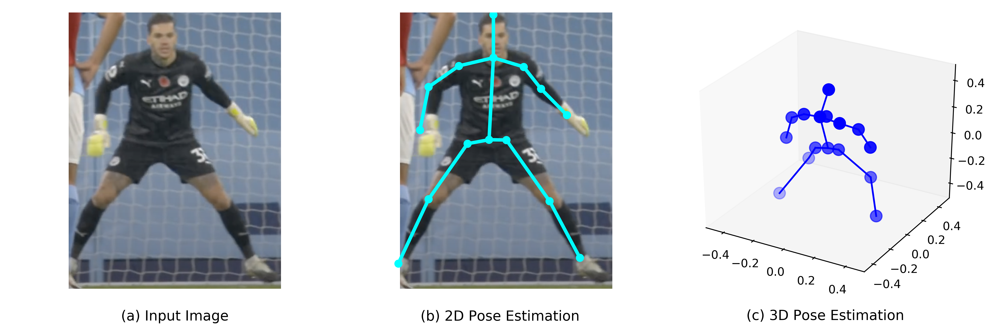
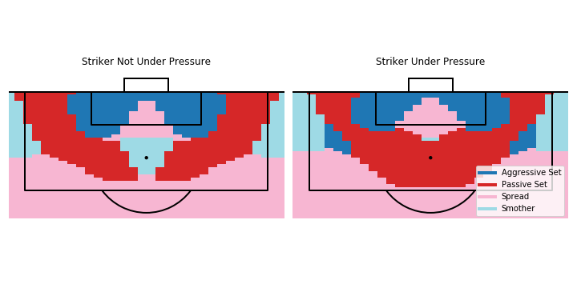

# Learning From the Pros: Extracting Professional Goalkeeper Technique from Broadcast Footage

This is the repository containing the code submitted to the open source competition at the MIT Sloan Sports Analytics Conference for our paper "Learning From the Pros". Our paper seeks to directly learn goalkeeper save technique from broadcast footage and basic x/y location data. 3D body pose data is extracted using a pre-trained convolutional neural network. We then apply unsupervised learning techniques to extract professional goalkeeper technique. A 1v1 expected saves model is then trained which predicts the probability of a save being made conditional on the save technique employed by the goalkeeper. From this, we can derive optimal technique maps and provide methods for amateur goalkeepers to compare their technique to that of the professionals.

We would really appreciate it if you voted for our paper via the link: https://docs.google.com/forms/d/e/1FAIpQLSc99T9vtNvZLSw-j4YPEz2S_jG_Fspx19WUFfuxX4MRLFeykw/viewform?usp=sf_link 

Link to the paper: https://arxiv.org/abs/2202.12259




### Open Source Data:
* 1v1 and Penalty images are found in the images/ folder

### Notebook Instructions:
* Clone this repo 

```console
$ python3 -m venv venv
$ source venv/bin/activate
$ pip install -r requirements.txt
$ python -m ipykernel install --user --name=ssac
```
* Enjoy the notebook (LearningFromThePros.ipynb) ensuring that the kernel is set to 'ssac'

### 3D Body Pose Model
We have included a notebook where you can extract the 3D body pose data from your own images! The notebook is stored in the PoseHG3D/ folder. We recommend running this notebook in Google Colab so that you can make use of their free GPU facilities. If running in Google Colab, please drag in the .py files from PoseHG3D into the Colab file system before running the model. You will also need to download the model weights at https://drive.google.com/file/d/1_2CCb_qsA1egT5c2s0ABuW3rQCDOLvPq/view


